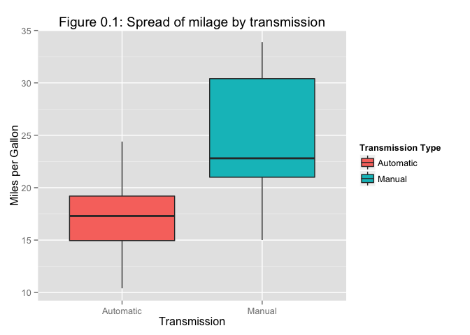

# Impact of car attributes on milage
Alexander Pyle, <apyle@github.com>  
October 9, 2016  

## Overview

The Moter Trend data from the `mtcars` data set contains key information that 
can be used to answer questions about transmissions and milage. For instance, we
can find answers to the questions:

- "Is an automatic or manual transmission better for MPG"
- "How different is the MPG between automatic manual transmission?"

The field `mtcars$am` contains the type of transmission, 0 is for automatic, and 
1 is for manual transmissions.

```r
### echo s.b. FALSE for production, is TRUE for development

# load required libraries
library(data.table)
library(dplyr)
```

```
## 
## Attaching package: 'dplyr'
## 
## The following objects are masked from 'package:data.table':
## 
##     between, last
## 
## The following object is masked from 'package:stats':
## 
##     filter
## 
## The following objects are masked from 'package:base':
## 
##     intersect, setdiff, setequal, union
```

```r
library(ggplot2)
library(xtable)

# get our data
data(mtcars)
myCars <- mutate (mtcars, transF = factor(am, labels = c("Automatic", "Manual")))
#rownames(myCars) <- rownames(mtcars)

# create a quick plot of the data
gp <- ggplot(myCars, aes(x=transF, y=mpg, fill=transF))
gp <- gp + geom_boxplot()
gp <- gp + labs(title = "Figure 0.1: Spread of milage by transmission",
                x = "Transmission", y = "Miles per Gallon")
gp <- gp + guides(fill = guide_legend(title = "Transmission Type"))
gp
```

 

```r
myCars
```

```
##     mpg cyl  disp  hp drat    wt  qsec vs am gear carb    transF
## 1  21.0   6 160.0 110 3.90 2.620 16.46  0  1    4    4    Manual
## 2  21.0   6 160.0 110 3.90 2.875 17.02  0  1    4    4    Manual
## 3  22.8   4 108.0  93 3.85 2.320 18.61  1  1    4    1    Manual
## 4  21.4   6 258.0 110 3.08 3.215 19.44  1  0    3    1 Automatic
## 5  18.7   8 360.0 175 3.15 3.440 17.02  0  0    3    2 Automatic
## 6  18.1   6 225.0 105 2.76 3.460 20.22  1  0    3    1 Automatic
## 7  14.3   8 360.0 245 3.21 3.570 15.84  0  0    3    4 Automatic
## 8  24.4   4 146.7  62 3.69 3.190 20.00  1  0    4    2 Automatic
## 9  22.8   4 140.8  95 3.92 3.150 22.90  1  0    4    2 Automatic
## 10 19.2   6 167.6 123 3.92 3.440 18.30  1  0    4    4 Automatic
## 11 17.8   6 167.6 123 3.92 3.440 18.90  1  0    4    4 Automatic
## 12 16.4   8 275.8 180 3.07 4.070 17.40  0  0    3    3 Automatic
## 13 17.3   8 275.8 180 3.07 3.730 17.60  0  0    3    3 Automatic
## 14 15.2   8 275.8 180 3.07 3.780 18.00  0  0    3    3 Automatic
## 15 10.4   8 472.0 205 2.93 5.250 17.98  0  0    3    4 Automatic
## 16 10.4   8 460.0 215 3.00 5.424 17.82  0  0    3    4 Automatic
## 17 14.7   8 440.0 230 3.23 5.345 17.42  0  0    3    4 Automatic
## 18 32.4   4  78.7  66 4.08 2.200 19.47  1  1    4    1    Manual
## 19 30.4   4  75.7  52 4.93 1.615 18.52  1  1    4    2    Manual
## 20 33.9   4  71.1  65 4.22 1.835 19.90  1  1    4    1    Manual
## 21 21.5   4 120.1  97 3.70 2.465 20.01  1  0    3    1 Automatic
## 22 15.5   8 318.0 150 2.76 3.520 16.87  0  0    3    2 Automatic
## 23 15.2   8 304.0 150 3.15 3.435 17.30  0  0    3    2 Automatic
## 24 13.3   8 350.0 245 3.73 3.840 15.41  0  0    3    4 Automatic
## 25 19.2   8 400.0 175 3.08 3.845 17.05  0  0    3    2 Automatic
## 26 27.3   4  79.0  66 4.08 1.935 18.90  1  1    4    1    Manual
## 27 26.0   4 120.3  91 4.43 2.140 16.70  0  1    5    2    Manual
## 28 30.4   4  95.1 113 3.77 1.513 16.90  1  1    5    2    Manual
## 29 15.8   8 351.0 264 4.22 3.170 14.50  0  1    5    4    Manual
## 30 19.7   6 145.0 175 3.62 2.770 15.50  0  1    5    6    Manual
## 31 15.0   8 301.0 335 3.54 3.570 14.60  0  1    5    8    Manual
## 32 21.4   4 121.0 109 4.11 2.780 18.60  1  1    4    2    Manual
```

```r
# variables used in the text and code, reinitiallized in the next chunk. Set here for use in text
lambda <- 0.2   # given by assignment
samples <- 40   # number of samples to use for the mean
simulations <- 1000     # number of simulations to run
popmean <- 1/lambda     # theoretical mean of the population
popvariance <- (1/lambda)^2 / samples # theoretical variance of the population
```

Thesis statement goes here

## Exploration


## Analysis


## Conclusion

Summary of what we discovered.

## Appendix

R Markdown source code for this analysis can be found at https://github.com/apyle/RegModels_PeerAssessment. 
This analysis was run with the following configuration. 


```r
library(devtools)
devtools::session_info() # display environment the script was create and run in.
```

```
## Session info --------------------------------------------------------------
```

```
##  setting  value                       
##  version  R version 3.1.2 (2014-10-31)
##  system   x86_64, darwin10.8.0        
##  ui       X11                         
##  language (EN)                        
##  collate  en_US.UTF-8                 
##  tz       America/Denver
```

```
## Packages ------------------------------------------------------------------
```

```
##  package    * version  date       source                            
##  assertthat   0.1      2013-12-06 CRAN (R 3.1.0)                    
##  colorspace   1.2-4    2013-09-30 CRAN (R 3.1.0)                    
##  data.table * 1.9.2    2014-02-27 CRAN (R 3.1.0)                    
##  DBI          0.3.1    2014-09-24 CRAN (R 3.1.1)                    
##  devtools   * 1.8.0    2015-05-09 CRAN (R 3.1.3)                    
##  digest       0.6.4    2013-12-03 CRAN (R 3.1.0)                    
##  dplyr      * 0.4.1    2015-01-14 CRAN (R 3.1.2)                    
##  evaluate     0.5.5    2014-04-29 CRAN (R 3.1.0)                    
##  formatR      1.0      2014-08-25 CRAN (R 3.1.1)                    
##  ggplot2    * 1.0.0    2014-05-21 CRAN (R 3.1.0)                    
##  git2r        0.10.1   2015-05-07 CRAN (R 3.1.3)                    
##  gtable       0.1.2    2012-12-05 CRAN (R 3.1.0)                    
##  htmltools    0.2.6    2014-09-08 CRAN (R 3.1.1)                    
##  knitr        1.8      2014-11-11 CRAN (R 3.1.2)                    
##  labeling     0.3      2014-08-23 CRAN (R 3.1.1)                    
##  lazyeval     0.1.10   2015-01-02 CRAN (R 3.1.2)                    
##  magrittr     1.5      2014-11-22 CRAN (R 3.1.2)                    
##  MASS         7.3-35   2014-09-30 CRAN (R 3.1.2)                    
##  memoise      0.2.1    2014-04-22 CRAN (R 3.1.0)                    
##  munsell      0.4.2    2013-07-11 CRAN (R 3.1.0)                    
##  plyr         1.8.1    2014-02-26 CRAN (R 3.1.0)                    
##  proto        0.3-10   2012-12-22 CRAN (R 3.1.0)                    
##  Rcpp         0.11.3   2014-09-29 CRAN (R 3.1.1)                    
##  RCurl        1.95-4.3 2014-07-29 CRAN (R 3.1.1)                    
##  reshape2     1.4.1    2014-12-06 CRAN (R 3.1.2)                    
##  rmarkdown    0.3.10   2015-01-18 Github (rstudio/rmarkdown@b96214b)
##  rversions    1.0.0    2015-04-22 CRAN (R 3.1.3)                    
##  scales       0.2.4    2014-04-22 CRAN (R 3.1.0)                    
##  stringr      0.6.2    2012-12-06 CRAN (R 3.1.0)                    
##  XML          3.98-1.1 2013-06-20 CRAN (R 3.1.0)                    
##  xtable     * 1.7-4    2014-09-12 CRAN (R 3.1.1)                    
##  yaml         2.1.13   2014-06-12 CRAN (R 3.1.0)
```

